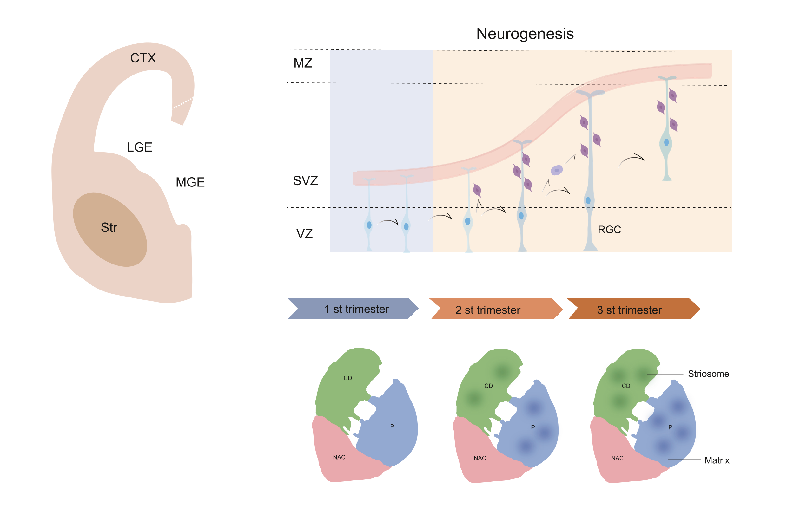

# Bioinformatic Method

## hLGE evodevo
The striatum is a structurally and functionally complex brain region that acts as the gate of telencephalic information output. Yet how human striatal cellular diversity emerges, and how its striosome-matrix compartmental architecture is developmentally assembled, remain largely unknown. We constructed a spatiotemporal atlas of the developing human lateral ganglionic eminence (hLGE)—the embryonic origin of striatal medium spiny neurons (MSNs)—by integrating single-cell and spatial transcriptomics data from gestational weeks 10 to 26. We uncovered a multilayered gene network that orchestrates the hierarchical diversification of MSNs. We also revealed lineage specification molecular programs that commit neural progenitors to striosome/matrix identities, which ultimately guide the spatiotemporal assembly of striosome/matrix compartments. Through a mouse model, we found that the disruption of striosome lineage specification is a potential participant in ASD etiology. Our findings reveal the developmental mechanism driving the emergence of striosome-matrix compartments in the developing human striatum.

 

  

